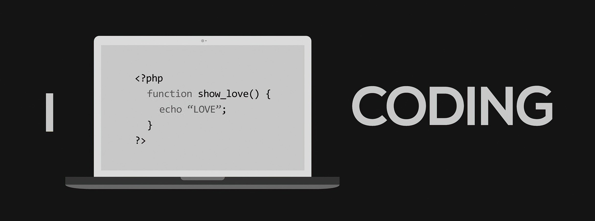

<h2>Hey there! I'm Nipun Eranda</h2>

<!-- ## 👋 &nbsp;Hey there! I'm Nipun Eranda -->

### 👨🏻‍💻 &nbsp;About Me

💡 &nbsp;I like to explore new technologies and develop software solutions and quick hacks.\
🎓 &nbsp;I'm currently studying Information Technology at the Sri Lanka Institute of Information Technology(SLIIT).\
🌱 &nbsp;I'm on track for learning more about Machine Learning, Systems Design, and Cloud Architecture.\
✍️ &nbsp;In my free time, I pursue Gaming, Painting and do penetration testings as hobbies/side hustles.\
💬 &nbsp;Feel free to reach out to me for pro bono consulting and volunteering, or just for some interesting discussion.\
✉️ &nbsp;You can shoot me an email at namarasekara71@gmail.com! I'll try to respond as soon as I can.\
📄 &nbsp; My Curriculum Vitae : <a style="color: red;" href="https://drive.google.com/file/d/1zyVbDBmfN59OiO4go8GSmFFA7WRGl0gv/view?usp=sharing">Check Here!</a>

### 🛠 &nbsp;Tech Stack

&nbsp;
&nbsp;
&nbsp;
&nbsp;
&nbsp;
&nbsp;
&nbsp;
&nbsp;
&nbsp;
&nbsp;\
&nbsp;
&nbsp;
&nbsp;
&nbsp;
&nbsp;
&nbsp;\
&nbsp;
&nbsp;
&nbsp;
&nbsp;
&nbsp;
&nbsp;\
&nbsp;
&nbsp;

### ⚙️ &nbsp;GitHub Analytics

